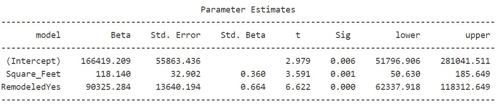

```{r setup, include=FALSE, echo=FALSE}
options(htmltools.dir.version = FALSE)
knitr::opts_chunk$set(
  fig.retina=2,
  #out.width = "75%",
  #out.height = "50%",
  htmltools.preserve.raw = FALSE,      # needed for windows
  scipen=100,                          # suppresses scientific notation
  getSymbols.warning4.0 = FALSE,       # suppresses getSymbols warnings
  cache = FALSE,
  echo = TRUE,
  hiline = TRUE,
  message = FALSE, 
  warning = FALSE
)


# install helper package (pacman)
# pacman loads and installs other packages, if needed
if (!require("pacman")) install.packages("pacman", repos = "http://lib.stat.cmu.edu/R/CRAN/")

# install and load required packages
# pacman should be first package in parentheses and then list others
pacman::p_load(pacman, tidyverse, gridExtra, magrittr, tools)

# verify packages (comment out in finished documents)
p_loaded()


```

```{r xaringan-themer, include=FALSE, warning=FALSE}
library(xaringanthemer)

palette <- c(
  SU_Orange1        = "#F76900",
  SU_Orange2        = "#FF8E00",
  SU_Red_Orange     = "#FF431B",
  SU_Blue1          = "#000E54",
  SU_Blue2          = "#203299",
  SU_Light_Blue     = "#2B72D7",
  SU_White          = "#FFFFFF",
  SU_Light_Gray     = "#ADB3B8",
  SU_Medium_Gray    = "#707780",
  SU_Black          = "#000000", 
  
  steel_blue        = "#4682B4",
  corn_flower_blue  = "#6495ED",
  deep_sky_blue     = "#00BFFF",
  dark_magenta      = "#8B008B",
  medium_orchid     = "#BA55D3",
  lime_green        = "#32CD32",
  light_sea_green   = "#20B2AA",
  chartreuse        = "#7FFF00",
  orange_red        = "#FF4500",
  white_smoke       = "#F5F5F5",
  dark_cyan         = "#008B8B",
  light_steel_blue  = "#B0C4DE",
  indigo            = "#4B0082",
  ivory             = "#FFFFF0",
  light_slate_grey  = "#778899",
  linen             = "#FAF0E6",
  steel_blue        = "#4682B4",
  blue_violet       = "#8A2BE2",
  dodger_blue       = "#1E90FF",
  light_blue        = "#ADD8E6",
  azure             = "#F0FFFF",
  lavender          = "#E6E6FA")

primary_color = "#4682B4"                # steel_blue
secondary_color = "#778899"              # light_slate_grey
white_color = "#FFFFF0"                  # ivory
black_color = "#000080"                  # navy

style_duo_accent(
  primary_color = primary_color,
  secondary_color = secondary_color,
  white_color = white_color,
  black_color = black_color,
  text_color = black_color,
  header_color = primary_color,
  background_color = white_color,
  code_inline_background_color = "#E6E6FA", # lavender
  link_color = "#1E90FF",                   # dodger_blue
  code_inline_color = "#4B0082",            # indigo
  text_bold_color = "#8B008B",              # dark_magenta
  header_font_google = google_font("Open Sans"),
  text_font_google = google_font("Open Sans"),
  code_font_google = google_font("Source Code Pro"),
  colors = palette
)


```

```{r xaringan-panelset, echo=FALSE}
xaringanExtra::use_panelset()
```

```{r xaringan-tile-view, echo=FALSE}
xaringanExtra::use_tile_view()
```

```{r xaringan-fit-screen, echo=FALSE}
xaringanExtra::use_fit_screen()
```

```{r xaringan-tachyons, echo=FALSE}
xaringanExtra::use_tachyons()
```

```{r xaringan-animate-css, echo=FALSE}
xaringanExtra::use_animate_css()
```

```{r xaringan-animate-all, echo=FALSE}
#xaringanExtra::use_animate_all("slide_up")
```

background-image: url("docs_files/images/sloth_faded.png")
background-size: cover

class: bottom, right

## BUA 345 - Lecture 13

### Categorical Regression - Interaction Model

<br>


#### Penelope Pooler Eisenbies

#### `r Sys.Date()`

[Wikipedia Sloth Page](https://en.wikipedia.org/wiki/Sloth)

---

### Getting Started with Markdown

- Download Zipped R project 

- Open Zipped folder and copy internal folder (R Project) to a BUA 345 folder on your computer NOT IN DOWLOADS

- Click on .Rproj file to open project

- Click on `code_data_output` file to open it.

- Click on `BUA_345_Lecture_13.Rmd` to open it.

- Run Setup Chunk

---

### Setup

* The setup chunk shows the packages needed for this demo.   

* R will install specified packages if needed (only required once after R is installed)  

* R will load specified packaged (required every time you start a new R session)  

* The first time you run this code, R will install these packages which will be slow.  

* **If you get warnings, that's okay.**  

* If you get **error messages**, I (or TA), can help you.

---

### Setup Chunk for Lecture 12

```{r setup for Lecture 13, include = T}


# this line specifies options for default options for all R Chunks
knitr::opts_chunk$set(echo=T, highlight=T)

# suppress scientific notation
options(scipen=100)

# install helper package that loads and installs other packages, if needed
if (!require("pacman")) install.packages("pacman", repos = "http://lib.stat.cmu.edu/R/CRAN/")

# install and load required packages
pacman::p_load(pacman,tidyverse, magrittr, olsrr, gridExtra, ggiraphExtra, knitr)

# verify packages
p_loaded()

```

**NOTES:

- ** Don't worry about `xaringanthemer` package (required for my slides but not for your code).

- New Packages: `ggiraphExtra` and `knitr`

---

### Review Question - House Remodeling Data from Lecture 12

```{r import and examine house remodel data}
house_remodel <- read_csv("house_remodel.csv", show_col_types = F) |>  # import data
  glimpse(width=75) 
house_remodel |> select(Remodeled) |> table()   # number of obs by category
house_remodel |> select(Price, Square_Feet) |> cor() |> round(2)  # correlation of price & sq. ft.
```

---

### Review of House Remodel Data - Parallel Lines Model

### Lecture 13 In-class Exercises

#### **Question 1 (L13) - Session ID: bua345s23**

Based on the `Parameter Estimates` table for the specified categorical regression model, which category is the baseline category?

```{r house model specified, results='hide'}

(house_rem_cat_ols<- ols_regress(Price ~ Square_Feet + Remodeled, data=house_remodel))

```

#### Abridged Output

```{r house model param estimates output, echo=F}

knitr::include_graphics("docs_files/images/house_rem_cat_mlr2.jpg")

```


---

### A Quick Comment About Formatted Output

- In HW 6 and below I have used R coding to format the output to make it easier to read.  The values are IDENTICAL to the unformatted output.
- The formatted output has different appearance in the slides and html file.

#### Abridged Output

```{r house model param estimates output repeated, echo=F}

knitr::include_graphics("docs_files/images/house_rem_cat_mlr2.jpg")

```

#### Formatted Output (Similar to HW 6)
```{r house model formal param estimated kable table, echo=F}

# formatted regression output
# model is saved and printed to screen
house_rem_cat_ols<- ols_regress(Price ~ Square_Feet + Remodeled, data=house_remodel)

# select columns from saved model
model_out <- tibble(house_rem_cat_ols$mvars, 
                    house_rem_cat_ols$betas,
                    house_rem_cat_ols$std_errors,
                    house_rem_cat_ols$tvalues,
                    house_rem_cat_ols$pvalues) |>
  
# round and rename columns
  mutate(`Model Term` = `house_rem_cat_ols$mvars`,
         `Beta` = round(`house_rem_cat_ols$betas`,2),
         `Std. Error` = round(`house_rem_cat_ols$std_errors`,2),
         `t statistic` = round(`house_rem_cat_ols$tvalues`,2),
         `P-value` = round(`house_rem_cat_ols$pvalues`,4)) |>
  
# select columns needed from output table
  select(`Model Term`,`Beta`, `Std. Error`, `t statistic`, `P-value`) 
  
# print output table using kable
(model_out |> kable())

```


---

### Quick Review of Categorical Regression

.pull-left[

- On Tuesday we covered the `Parallel Lines` Model:

  - A Parallel Lines model has two X variables, one quantitative and one categorical variable.
  
  - Model estimates a separate SLR model for each category in the categorical variable.

  - Model assumes all categories have the same **SLOPE**.

  - Model estimates a separate **INTERCEPT** for each category.

  - Model output shows results of a hypothesis test to determine if each non-baseline category's intercept is significantly different from baseline intercept.


]

.pull-right[

```{r house remodel mlr model, echo=F}

# mlr model created using lm
rem_cat_lm <- lm(Price ~ Square_Feet + Remodeled, data=house_remodel)

# create and save interactive plot
(int_rem_mlr <- ggPredict(rem_cat_lm, interactive=T))

```

]

---

### Calculations from Output Values and Interpretation

- By default R chooses baseline categories alphabetically

  - `No` is before `Yes` so un-`Remodeled` houses are the baseline

  - un-Remodeled SLR Model: `Est. Price = 137549.093 + 137.879 * Square_Feet`

  - Remodeled SLR Model:

    - `Est. Price = 137549.093 + 137.879 * Square_Feet + 90917.216`

    - `Est. Price = 137549.093 + 90917.216 + 137.879 * Square_Feet`

    - `Est. Price = _____ + 137.879 * Square_Feet`

- **Interpretation:**

  - Prices of remodeled houses are about ***91 thousand dollars more than similar houses without remodeling***, after accounting for square footage.

  - This difference is statistically significant (P-value < 0.001)

---

### HW 6 - Questions 1 - 6

- Analyses and output are identical to what was done in Lecture 12.

- Output shown below are a screenshot from provided .html file for HW 6

```{r HW 6 Q1_6 param est sreeenshot, echo=F}



```

---

### Categorical Regression with Interactions

- The categorical models covered so far assume that the `SLR` models for all categories have the same slope.

- How do we examine that assumption?

- For example:

  - In the celebrity data in Lecture 13, the data showed a decrease in earnings as they got older.
    
  - Slope was assumed to be IDENTICAL for both males and females 

  - That may not be true for all celebrities.
  
- In the following small dataset, we will look at male celebrities only and examine if actors and athletes salaries follow the same trend.

---

### Import and Examine Celebrity Profession Data

```{r import and examine celeb_prof data}

# import and examine celeb profession dataset
celeb_prof <- read_csv("celeb_prof.csv", show_col_types=F) |>
  glimpse(width=75)

# use table to summarize data by category
celeb_prof |> select(Profession) |> table()

```


---

### Examine Correlations in Data and within Each Category

- Note that if categories have different slopes, correlations for whole dataset will be misleading.

```{r correlations celeb_prof data}

# all data
celeb_prof |> select(Earnings, Age) |> cor() |> round(2)

# actors only
celeb_prof |> filter(Profession=="Actor") |>
  select(Earnings, Age) |> cor() |> round(2)

# athletes only
celeb_prof |> filter(Profession=="Athlete") |>
  select(Earnings, Age) |> cor() |> round(2)

```

---

### Explore and Plot Data

.pull-left[

- Scatter plot shows that a regression model should be created with

  - Different intercepts for each profession

  - Different slopes for each profession
  

```{r exploratory scatter plot code for celeb_prof data}

celeb_sctrplot <- celeb_prof |> #scatterplot code
  ggplot() +
  geom_point(aes(x=Age, y=Earnings, color=Profession), size=4) +
  theme_classic() + 
  theme(axis.title = element_text(size=18),
        axis.text = element_text(size=15),
        legend.text = element_text(size=10),
        plot.background = element_rect(colour = "darkgrey", fill=NA, size=2))

```


]

.pull-right[

```{r show celeb scatterplot, fig.dim=c(7,6) , echo=F}

celeb_sctrplot

```

]

---

### Interactive Model Plot

.pull-left[

- Model specified with interaction term:

  `Age*Profession`
  
```{r celeb profession model plot}

# create linear model with categories an interaction
celeb_prof_lm <- 
  lm(Earnings ~ Age + Profession + 
       Age*Profession, data=celeb_prof)

# create interactive plot of model
# copy and paste this into console (below) to see plot in viewer
clb_int <- ggPredict(celeb_prof_lm, 
                     interactive = T)

```

- The interactive plot shows each model equation when the cursor is on the line.

]


.pull-right[

```{r echo=F}

clb_int 

```

]

---

### Regression Model

-   Now that we understand the data and linear trends, we can examine and interpret the regression model output.

```{r celeb_prof regression, results='hide'}

# formatted regression output
# model is saved and printed to screen
(celeb_interaction_ols<- ols_regress(Earnings ~ Age + Profession + Age*Profession,
                                     data=celeb_prof, iterm = T))
 

```


#### Abridged Output

```{r celeb_prof param est table, echo=F}

knitr::include_graphics("docs_files/images/clb_prof_int_mlr.jpg")

```

---

### Model Interpretation - Interpreting model coefficients (betas)

- **Baseline category is first alphabetically**

  - Actor comes before Athlete in the alphabet so **Actor is the baseline category**.

  - **Actor SLR Model: `Earnings = -50.297 + 1.824*Age`**
  
<br>
  
- **`ProfessionAthlete` term:** Difference from Actor (baseline) model Intercept

- **`Age:ProfessionAthlete` term:** Difference from Actor model Slope

  - Athlete SLR Model requires some calculations:

    - `Earnings = -50.297 + 1.824*Age + 227.218 - 5.063*Age`

    - `Earnings = (-50.297 + 227.218) + (1.824 - 5.063)*Age`

    - `Earnings = 176.921 - ____*Age`

    -  ***Athlete SLR Model:*** `Earnings = 176.921 - ____*Age` 

---

### Lecture 13 In-class Exercises

#### **Question 2 (L13) - Session ID: bua345s23**

- **What is the slope term (estimated `beta` for Age) for the Athlete SLR model?**

  - Specify answer to two decimal places.
  
#### Abridged Output

```{r celeb_prof param est table 2, echo=F}

knitr::include_graphics("docs_files/images/clb_prof_int_mlr.jpg")

```
  
  
- **`ProfessionAthlete` term:** Difference from Actor (baseline) model Intercept

- **`Age:ProfessionAthlete` term:** Difference from Actor model Slope

  - `Earnings = (-50.297 + 227.218) + (1.824 - 5.063)*Age`

  -  ***Athlete SLR Model:*** `Earnings = 176.921 - ____*Age` 
  
---

### Determining Statistical Significance

- In this case, we don't need to examine the P-values because the model differences between groups are so clear (but we will).
- The two intercepts and two slopes are **VERY** different.
- Reminder of Hypothesis Testing concepts:

  - **The SMALLER the P-value, the more evidence there is that the true value of Beta (model term) is not zero.**
  - If this sentence is not clear to you, **you are responsible for reviewing the Review Materials** on Hypothesis Tests and Significance Tests (and other related topics):

     - **[Review Materials Folder on Blackboard](https://blackboard.syracuse.edu/webapps/blackboard/content/listContentEditable.jsp?content_id=_8630674_1&course_id=_494704_1&mode=reset)**
     - **[Khan Academy - The Idea of Significance tests](https://www.khanacademy.org/math/statistics-probability/significance-tests-one-sample/idea-of-significance-tests/v/simple-hypothesis-testing)**
     - **[Khan Academy - Comparing a P-value to a Significance level](https://www.khanacademy.org/math/statistics-probability/significance-tests-one-sample/tests-about-population-mean/v/comparing-p-value-from-t-statistic-to-significance-level?modal=1)**

- **P-value for difference in intercepts (`ProfessionAthlete`):** < 0.001

  - Intercepts for Actors SLR model and Athletes SLR model are significantly different.

-  **P-value for difference in slopes (`Age:ProfessionAthlete`):** < 0.001

  - Slopes for Actors SLR model and Athletes SLR model are significantly different.

-  **These interpretations are in agreement with what we can easily see in the Interactive Model Plot.**
    
---

### Movie Genres and Costs

-   Is length of a movie (`Runtime`) a good predictor of the movie budget?

-   Does the relationship between movie length and budget differ by movie genre?

#### Import Movie Data

```{r import movies data}

# Import and examine data
movies <- read_csv("movies.csv", show_col_types = F) |>
  glimpse(width=75)

# use table to examine categories in the data
movies |> select(Genre) |> table()

```

---

### Examine Correlations in Movie Data

- Again, if categories have different slopes, correlations for whole dataset will be misleading.

```{r correlations in movies data}

# all data
movies |> select(Budget, Runtime) |> cor() |> round(2)

# actions movies only
movies |> filter(Genre == "Action") |>
  select(Budget, Runtime) |> cor() |> round(2)
  
# suspense/horror movies only
movies |> filter(Genre == "Suspense / Horror") |>
  select(Budget, Runtime) |> cor() |> round(2)


```

---

### Explore and Plot Data

.pull-left[

-   Plot below clearly shows that a regression model should be created with

    -   Different intercepts for each profession

    -   Different slopes for each profession

```{r exploratory scatter plot of movie data}

movie_scrtplot <- movies |>
  ggplot() +
  geom_point(aes(x=Runtime, y=Budget, color=Genre), size=4) +
  theme_classic() + 
  labs(x="Run time (Movie Length)") +
  theme(axis.title = element_text(size=18),
        axis.text = element_text(size=15),
        legend.text = element_text(size=10),
        plot.background = element_rect(colour = "darkgrey", fill=NA, size=2))

```


]

.pull-right[

```{r show movie scatterplot, fig.dim=c(7,6) , echo=F}

movie_scrtplot

```


]

---

### Interactive Model Plot

.pull-left[

- Model specified with interaction term:

  `Runtime*Genre`
  
```{r movie model plot}

# create linear model with categories an interaction
movie_cat_lm <- lm(Budget ~ Runtime + Genre + 
                     Runtime*Genre, data=movies)

# create interactive plot of model
# copy and paste this into console (below) to see plot in viewer
movie_int <- ggPredict(movie_cat_lm, 
          interactive = T)

```

- The interactive plot shows each model equation when the cursor is on the line.

]


.pull-right[

```{r echo=F}

movie_int

```

]

---

### Regression Model

- Again, we can examine and interpret the regression model output.

```{r movie regression, results='hide'}

# formatted regression output
# model is saved and printed to screen
(movie_interaction_ols<- ols_regress(Budget ~ Runtime + Genre + 
                                       Runtime*Genre, data=movies, iterm = T))
 

```


#### Abridged Output

```{r movie param est table, echo=F}


```

---

### Model Interpretation - Interpreting model coefficients (betas)

- **Baseline category is first alphabetically**

  - Action comes before Suspense/Horror in the alphabet so Action is the baseline category.

  - **Action SLR Model: `Budget = -286.67 + 3.25*RunTime`**
  
<br>

- **`GenreSuspense / Horror` term:** Difference from Action (baseline) model Intercept

- **`Runtime:GenreSuspense / Horror` term:** Difference from Action model Slope

  - Suspense / Horror SLR Model requires some calculations:

    - `Budget = -286.67 + 3.25*RunTime + 218.75 - 2.35*Runtime`

    - `Budget = (-286.67 + 218.75) + (3.25 - 2.35)*Runtime`

    - `Budget = ____ - 0.9*Runtime`

    - ***Suspense / Horror SLR Model:*** `Budget = ____ - 0.9*Runtime`
    
---

### Lecture 13 In-class Exercises

#### **Question 3 (L13) - Session ID: bua345s23**

- **What is the intercept term (estimated `beta`) for the Suspense / Horror SLR model?**

  - Specify answer to two decimal places.
  
#### Abridged Output

```{r movie param est table 2, echo=F}


```
  
- **`GenreSuspense / Horror` term:** Difference from Action (baseline) model Intercept

- **`Runtime:GenreSuspense / Horror term`:** Difference from Action model Slope

    - `Budget = (-286.67 + 218.75) + (3.25 - 2.35)*Runtime`

    - ***Suspense / Horror SLR Model:*** `Budget = ____ - 0.9*Runtime`
  
---

### Determining Statistical Significance

- In this case, we don't need to examine the P-values because the model differences between groups are so clear (but we will).
- The two intercepts and two slopes are **VERY** different.
- Reminder of Hypothesis Testing concepts:

  - **The SMALLER the P-value, the more evidence there is that the true value of Beta (model term) is not zero.**
  - If this sentence is not clear to you, **you are responsible for reviewing the Review Materials** on Hypothesis Tests and Significance Tests (and other related topics):

     - **[Review Materials Folder on Blackboard](https://blackboard.syracuse.edu/webapps/blackboard/content/listContentEditable.jsp?content_id=_8630674_1&course_id=_494704_1&mode=reset)**
     - **[Khan Academy - The Idea of Significance tests](https://www.khanacademy.org/math/statistics-probability/significance-tests-one-sample/idea-of-significance-tests/v/simple-hypothesis-testing)**
     - **[Khan Academy - Comparing a P-value to a Significance level](https://www.khanacademy.org/math/statistics-probability/significance-tests-one-sample/tests-about-population-mean/v/comparing-p-value-from-t-statistic-to-significance-level?modal=1)**
     

- **P-value for difference in intercepts (`GenreSuspense / Horror`):** < 0.001

  - Intercepts for these two distinct genre SLR models are `_____` (Next Question).

-  **P-value for difference in slopes (`Runtime:GenreSuspense / Horror term`):** < 0.001

  - Slopes for for these two distinct genre SLR models are `_____` (Next Question).

-  **These interpretations are in agreement with what we can easily see in the Interactive Model Plot.**

---

### Lecture 13 In-class Exercises

#### **Question 4 (L13) - Session ID: bua345s23**

The difference in intercepts and the difference in slopes between the model for `Action` movies and the model for `Suspense / Horror` movies are both `_____`.
 
 <br>
 
#### **Question 5 (L13) - Session ID: bua345s23**
 
Recall that the cutoff for determining significance of a regression model term based on it's P-value is 0.05.

Fill in the blank:

The smaller the P-value, the `_____` evidence there is that the Beta coefficient is non-zero and the term is useful to the model.

---
 
### HW 6 - Questions 7 - 16

- Dataset has three categories of Diamonds:

   - Colorless

   - Faint yellow

   - Nearly colorless

<br>

- **Colorless** is first alphabetically so that is the **baseline category** by default.

  -   Each color category has unique intercept.
  -   Each color category has a unique slope
  -   The interactive model plot and abridged regression output are provided.
  -   All Blackboard questions can be answered using provided `.html` output and verified using provided. interactive plot.
  
---

### Looking Ahead - What's Next?

- This week, ALL of the categorical models we have covered could be simplified to multiple SLRs, with same or different slopes.

- ALL of the variables have had P-values less than 0.05 so the terms were all useful.

- **There are many many model options where these two facts are not true.**

- Time permitting, here's a brief look at these `insurance` data which includes multiple explanatory variables:

```{r brief look at another dataset}

insurance <- read_csv("Insurance.csv", show_col_types=F) |>
  glimpse(width=75)

```
 
---

### Variable and Model Selection

-   There are 3 quantitative variables:

    -   Age
    -   BMI
    -   Children

-   There are 3 categorical variables:

    -   Sex
    -   Smoker
    -   Region

-   There are literally hundreds of possible models including interaction terms

-   Note that an interaction can also be between two quantitative variables

-   You can also have interaction terms with three variables (but I try to avoid those).

-   How do we sort through all of the possible options?

    -   Software helps us pare down all the possible models to a few choices.
    -   The analyst then uses critical thinking and examination of the data to determine the final model.

-   Variable and Model Selection methods are the next set of topics.

---

background-image: url("docs_files/images/tired_panda_faded.png")
background-size: cover

.pull-left[

### **Key Points from Today**

.bg-azure.b--dark_cyan.ba.bw2.br3.shadow-5.ph2[

- **Categorical Interaction Model**

  - Separate SLR for each group.
  - BOTH slopes and intercepts can differ by category
  - We can test if interaction term (slope difference) is significant.

- **Next Topics** 
  - Comparing model goodness of fit
  - Introduction to variable selection

-   HW 6 was posted yesterday and is due 3/7 

]

]

.pull-right[

.bg-azure.b--dark_cyan.ba.bw2.br3.shadow-5.ph3[
You may submit an 'Engagement Question' about each lecture until midnight on the day of the lecture. **A minimum of four submissions are required during the semester.**
]

]

